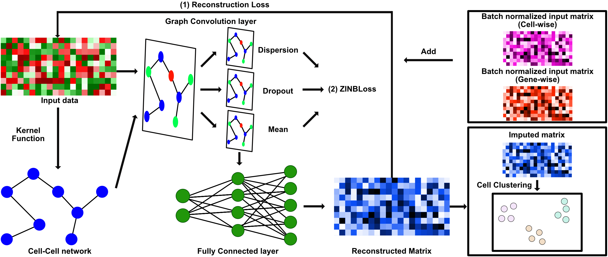

# scVGAE: A Novel Approach using ZINB-Based Variational Graph Autoencoder for Single-Cell RNA-Seq Imputation

[](https://arxiv.org/abs/2403.08959)



This is an official implementation of the paper, "scVGAE: A Novel Approach using ZINB-Based Variational Graph Autoencoder for Single-Cell RNA-Seq Imputation"

This model utilizes Zero-Inflated Negative Binomial Loss and MSELoss to impute the single-cell RNA-seq (scRNA).

scVGAE has been implemented in Python.

To get started immediately, check out our tutorials:
- [Tutorial](https://github.com/inoue0426/scVGAE/blob/main/sample%20notebook.ipynb)

## Requirement

```
numpy==1.23.5
pandas==2.0.3
scikit-learn==1.3.0
torch==1.13.1+cu116
torch-geometric==2.3.1
torch-sparse==0.6.17+pt113cu116
tqdm==4.65.0
```

** Note: To utilize GPU acceleration, it is necessary to configure your own CUDA environment for PyTorch and PyTorch-Sparse.

## Environment

Our experiment was conducted on Ubuntu with an NVIDIA A100 Tensor Core GPU, but this also works on an M1 Mac. To use this model, please adjust the requirements to suit your environment, paying particular attention to the PyTorch-related libraries. 
**  Please note that as of October 8, 2023, this model doesn't support GPU on M1 Mac due to compatibility issues with PyTorch Geometric. 

## Installation from GitHub
To clone the repository and install manually, run the following from a terminal:
```
git clone git@github.com:inoue0426/scVGAE.git
cd scBiGCN
conda create --name scVGAE python=3.10 -y
conda activate scVGAE
pip install -r requirement.txt
# Please make sure to change the version to match the version of your GPU/CPU machine exactly.
pip install --no-cache-dir  torch==1.13.1+cu116 --extra-index-url https://download.pytorch.org/whl/cu116
pip install --no-cache-dir torch_geometric
pip install --no-cache-dir pyg_lib torch_scatter torch_sparse torch_cluster torch_spline_conv -f https://data.pyg.org/whl/torch-1.13.1%2Bcu116.html
```

## Quick start

```python
import scVGAE
# Here, df should be cell by genes data and index is cell types.
scVGAE.run_model(df, verbose=True) 
```

## Citation

```
@misc{inoue2024scvgae,
      title={scVGAE: A Novel Approach using ZINB-Based Variational Graph Autoencoder for Single-Cell RNA-Seq Imputation}, 
      author={Yoshitaka Inoue},
      year={2024},
      eprint={2403.08959},
      archivePrefix={arXiv},
      primaryClass={q-bio.GN}
}
```

## Help
If you have any questions or require assistance using MAGIC, please feel free to make issues on https://github.com/inoue0426/scVGAE/
